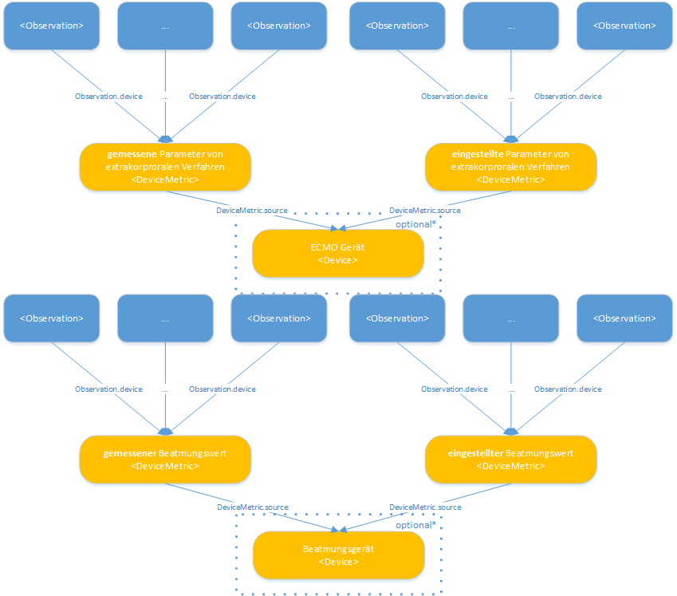

# Profile - MII IG ICU v2026.0.3

* [**Inhaltsverzeichnis**](toc.md)
* **Profile**

## Profile

### Interaktive Profilübersicht

Modul-eigene Profile (dieses Paket)

##### Parameter von extrakorporalen Verfahren

[Extrakorporales Verfahren](StructureDefinition-mii-pr-icu-extrakorporales-verfahren.md)
[Eingestellte Gemessene Parameter Extrakorporale Verfahren](StructureDefinition-mii-pr-icu-dm-eingest-gem-parameter-extrakorporale-verfahren.md)
[Parameter von Extrakorporalen Verfahren](StructureDefinition-mii-pr-icu-parameter-von-extrakorporalen-verfahren.md)
[Arterieller Druck](StructureDefinition-mii-pr-icu-ect-arterieller-druck.md)
[Blutfluss Cardiovasculaeres Geraet](StructureDefinition-mii-pr-icu-ect-blutfluss-cardiovasculaeres-geraet.md)
[Blutfluss Extrakorporaler Gasaustausch](StructureDefinition-mii-pr-icu-ect-blutfluss-extrakorporaler-gasaustausch.md)
[Blutflussindex Extrakorporaler Gasaustausch](StructureDefinition-mii-pr-icu-ect-blutflussindex-extrakorporaler-gasaustausch.md)
[Dauer Extrakorporaler Gasaustausch](StructureDefinition-mii-pr-icu-ect-dauer-extrakorporaler-gasaustausch.md)
[Dauer Haemodialysesitzung](StructureDefinition-mii-pr-icu-ect-dauer-haemodialysesitzung.md)
[Gasfluss](StructureDefinition-mii-pr-icu-ect-gasfluss.md)
[Haemodialyse Blutfluss](StructureDefinition-mii-pr-icu-ect-haemodialyse-blutfluss.md)
[Ionisiertes Kalzium Nierenersatzverfahren](StructureDefinition-mii-pr-icu-ect-ionisiertes-kalzium-nierenersatzverfahren.md)
[Substituatfluss](StructureDefinition-mii-pr-icu-ect-substituatfluss.md)
[Substituatvolumen](StructureDefinition-mii-pr-icu-ect-substituatvolumen.md)
[Venoeser Druck](StructureDefinition-mii-pr-icu-ect-venoeser-druck.md)

##### Beatmungswerte

[Beatmung](StructureDefinition-mii-pr-icu-beatmung.md)
[Eingestellte Gemessene Parameter Beatmung](StructureDefinition-mii-pr-icu-dm-eingestellte-gemessene-parameter-beatmung.md)
[Parameter von Beatmung](StructureDefinition-mii-pr-icu-parameter-von-beatmung.md)
[Atemwegsdruck Bei Null Expiratorischem Gasfluss](StructureDefinition-mii-pr-icu-vent-atemwegsdruck-bei-null-expiratorischem-gasfluss.md)
[Atemwegsdruck Bei Mittlerem Expiratorischem Gasfluss](StructureDefinition-mii-pr-icu-vent-atemwegsdruck-mittlerem-expiratorischem-gasfluss.md)
[Atemzugvolumen Einstellung](StructureDefinition-mii-pr-icu-vent-atemzugvolumen-einstellung.md)
[Atemzugvolumen Waehrend Beatmung](StructureDefinition-mii-pr-icu-vent-atemzugvolumen-waehrend-beatmung.md)
[Beatmungsvolumen Pro Minute Maschineller Beatmung](StructureDefinition-mii-pr-icu-vent-beatmungsvolumen-min-maschineller-beatmung.md)
[Beatmungszeit Hohem Druck](StructureDefinition-mii-pr-icu-vent-beatmungszeit-hohem-druck.md)
[Beatmungszeit Niedrigem Druck](StructureDefinition-mii-pr-icu-vent-beatmungszeit-niedrigem-druck.md)
[Druckdifferenz Beatmung](StructureDefinition-mii-pr-icu-vent-druckdifferenz-beatmung.md)
[Dynamische Kompliance](StructureDefinition-mii-pr-icu-vent-dynamische-kompliance.md)
[Eingestellter Inspiratorischer Gasfluss](StructureDefinition-mii-pr-icu-vent-eingestellter-inspiratorischer-gasfluss.md)
[Einstellung Ausatmungszeit Beatmung](StructureDefinition-mii-pr-icu-vent-einstellung-ausatmungszeit-beatmung.md)
[Einstellung Einatmungszeit Beatmung](StructureDefinition-mii-pr-icu-vent-einstellung-einatmungszeit-beatmung.md)
[Endexpiratorischer Kohlendioxidpartialdruck](StructureDefinition-mii-pr-icu-vent-endexpiratorischer-kohlendioxidpartialdruck.md)
[Exspiratorischer Gasfluss](StructureDefinition-mii-pr-icu-vent-exspiratorischer-gasfluss.md)
[Exspiratorischer Sauerstoffpartialdruck](StructureDefinition-mii-pr-icu-vent-exspiratorischer-sauerstoffpartialdruck.md)
[Horowitz In Arteriellem Blut](StructureDefinition-mii-pr-icu-vent-horowitz-in-arteriellem-blut.md)
[Inspiratorische Sauerstofffraktion](StructureDefinition-mii-pr-icu-vent-inspiratorische-sauerstofffraktion.md)
[Inspiratorischer Gasfluss](StructureDefinition-mii-pr-icu-vent-inspiratorischer-gasfluss.md)
[Maximaler Beatmungsdruck](StructureDefinition-mii-pr-icu-vent-maximaler-beatmungsdruck.md)
[Maximaler Inspiratorischer Beatmungsdruck](StructureDefinition-mii-pr-icu-vent-maximaler-inspiratorischer-beatmungsdruck.md)
[Mechanische Atemfrequenz Beatmet](StructureDefinition-mii-pr-icu-vent-mechanische-atemfrequenz-beatmet.md)
[Mittlerer Beatmungsdruck](StructureDefinition-mii-pr-icu-vent-mittlerer-beatmungsdruck.md)
[Mittlerer Inspiratorischer Beatmungsdruck](StructureDefinition-mii-pr-icu-vent-mittlerer-inspiratorischer-beatmungsdruck.md)
[Plateau Beatmungsdruck](StructureDefinition-mii-pr-icu-vent-plateau-beatmungsdruck.md)
[Positiv Endexpiratorischer Druck](StructureDefinition-mii-pr-icu-vent-positiv-endexpiratorischer-druck.md)
[Spontane Atemfrequenz Beatmet](StructureDefinition-mii-pr-icu-vent-spontane-atemfrequenz-beatmet.md)
[Spontane Mechanische Atemfrequenz Beatmet](StructureDefinition-mii-pr-icu-vent-spontane-mechanische-atemfrequenz-beatmet.md)
[Spontanes Atemzugvolumen](StructureDefinition-mii-pr-icu-vent-spontanes-atemzugvolumen.md)
[Spontanes Plus Mechanisches Atemzugvolumen](StructureDefinition-mii-pr-icu-vent-spontanes-plus-mechanisches-atemzugvolumen.md)
[Unterstuetzungsdruck Beatmung](StructureDefinition-mii-pr-icu-vent-unterstuetzungsdruck-beatmung.md)
[Zeitverhaeltnis Ein Ausatmung](StructureDefinition-mii-pr-icu-vent-zeitverhaeltnis-ein-ausatmung.md)

##### Bilanzen

[Bilanz](StructureDefinition-mii-pr-icu-bilanz.md)
[Bilanz Ausfuhr Blutverlust](StructureDefinition-mii-pr-icu-bilanz-ausfuhr-blutverlust.md)
[Bilanz Ausfuhr Drainage Generisch](StructureDefinition-mii-pr-icu-bilanz-ausfuhr-drainage-generisch.md)
[Bilanz Ausfuhr Fluessigkeit Gesamt](StructureDefinition-mii-pr-icu-bilanz-ausfuhr-fluessigkeit-gesamt.md)
[Bilanz Ausfuhr Gallenfluessigkeit](StructureDefinition-mii-pr-icu-bilanz-ausfuhr-gallenfluessigkeit.md)
[Bilanz Ausfuhr Haemofiltration Einzelmesswerte](StructureDefinition-mii-pr-icu-bilanz-ausfuhr-haemofiltration-einzelmesswerte.md)
[Bilanz Ausfuhr Magensonde](StructureDefinition-mii-pr-icu-bilanz-ausfuhr-magensonde.md)
[Bilanz Ausfuhr OP Drainage](StructureDefinition-mii-pr-icu-bilanz-ausfuhr-op-drainage.md)
[Bilanz Ausfuhr Pankreasdrainage](StructureDefinition-mii-pr-icu-bilanz-ausfuhr-pankreasdrainage.md)
[Bilanz Ausfuhr Stuhlgang](StructureDefinition-mii-pr-icu-bilanz-ausfuhr-stuhlgang.md)
[Bilanz Ausfuhr Urin](StructureDefinition-mii-pr-icu-bilanz-ausfuhr-urin.md)
[Bilanz Ausfuhr Wunddrainage](StructureDefinition-mii-pr-icu-bilanz-ausfuhr-wunddrainage.md)
[Bilanz Einfuhr Abgepumpte Muttermilch](StructureDefinition-mii-pr-icu-bilanz-einfuhr-abgepumpte-muttermilch.md)
[Bilanz Einfuhr Enterale Fluessigkeit](StructureDefinition-mii-pr-icu-bilanz-einfuhr-enterale-fluessigkeit.md)
[Bilanz Einfuhr Fluessigkeit Gesamt](StructureDefinition-mii-pr-icu-bilanz-einfuhr-fluessigkeit-gesamt.md)
[Bilanz Einfuhr Muttermilch](StructureDefinition-mii-pr-icu-bilanz-einfuhr-muttermilch.md)
[Bilanz Einfuhr Orale Fluessigkeit](StructureDefinition-mii-pr-icu-bilanz-einfuhr-orale-fluessigkeit.md)
[Bilanz Einfuhr Saeuglingsnahrung](StructureDefinition-mii-pr-icu-bilanz-einfuhr-saeuglingsnahrung.md)
[Bilanz Einfuhr Spendermilch](StructureDefinition-mii-pr-icu-bilanz-einfuhr-spendermilch.md)
[Bilanz Tagesbilanz Fluessigkeit](StructureDefinition-mii-pr-icu-bilanz-tagesbilanz-fluessigkeit.md)

##### Monitoring und Vitaldaten (modul-eigen)

[MUV Arterieller Blutdruck](StructureDefinition-mii-pr-icu-muv-arterieller-blutdruck.md)
[MUV Atemfrequenz](StructureDefinition-mii-pr-icu-muv-atemfrequenz.md)
[MUV Herzfrequenz](StructureDefinition-mii-pr-icu-muv-herzfrequenz.md)
[MUV Koerpergewicht](StructureDefinition-mii-pr-icu-muv-koerpergewicht.md)
[MUV Koerpergroesse](StructureDefinition-mii-pr-icu-muv-koerpergroesse.md)
[MUV Koerperlaenge](StructureDefinition-mii-pr-icu-muv-koerperlaenge.md)
[MUV Kopfumfang](StructureDefinition-mii-pr-icu-muv-kopfumfang.md)
[MUV zerebraler Perfusionsdruck](StructureDefinition-mii-pr-icu-muv-zerebraler-perfusionsdruck.md)

##### Untersuchungen

[Untersuchung Pupillenbefund](StructureDefinition-mii-pr-icu-untersuchung-pupillenbefund.md)
[Untersuchung Pupillenform](StructureDefinition-mii-pr-icu-untersuchung-pupillenform.md)
[Untersuchung Pupillengroesse](StructureDefinition-mii-pr-icu-untersuchung-pupillengroesse.md)
[Untersuchung Pupillenlichtreaktion Direkt](StructureDefinition-mii-pr-icu-untersuchung-pupillenlichtreaktion-direkt.md)
[Untersuchung Pupillenlichtreaktion Indirekt](StructureDefinition-mii-pr-icu-untersuchung-pupillenlichtreaktion-indirekt.md)
[Untersuchung Pupillensymmetrie](StructureDefinition-mii-pr-icu-untersuchung-pupillensymmetrie.md)

##### Scores

[Score](StructureDefinition-mii-pr-icu-score.md)
[Score CAM-ICU](StructureDefinition-mii-pr-icu-score-cam-icu.md)
[Score Faces Pain Scale Revised](StructureDefinition-mii-pr-icu-score-faces-pain-scale-revised.md)
[Score GCS](StructureDefinition-mii-pr-icu-score-gcs.md)
[Score ICDSC](StructureDefinition-mii-pr-icu-score-icdsc.md)
[Score Numerische Ratingskala](StructureDefinition-mii-pr-icu-score-numerische-ratingskala.md)
[Score RASS](StructureDefinition-mii-pr-icu-score-rass.md)
[Score SOFA](StructureDefinition-mii-pr-icu-score-sofa.md)
[Score Visuelle Analogskala](StructureDefinition-mii-pr-icu-score-visuelle-analogskala.md)
[Score Wong-Baker-FACES-Schmerzskala](StructureDefinition-mii-pr-icu-score-wong-baker-faces-schmerzskala.md)
[Score ZOPA](StructureDefinition-mii-pr-icu-score-zopa.md)

##### Geräteinformationen

[Device](StructureDefinition-mii-pr-icu-device.md)

ISiK-gehostete Profile (de.gematik.isik 6.0.0)

Diese Profile werden im Paket de.gematik.isik von der gematik gehostet und versioniert; dieser Leitfaden listet sie als fachlichen Bestandteil des KDS Intensivmedizin. Die Liste ist aus der gepinnten Paketversion generiert und ändert sich nur mit einem bewussten Pin-Wechsel.

##### Generische Profile (3)

[Koerpertemperatur Generisch](https://simplifier.net/resolve?canonical=https://gematik.de/fhir/isik/StructureDefinition/sd-mii-icu-koerpertemperatur-generisch)
[Monitoring und Vitaldaten](https://simplifier.net/resolve?canonical=https://gematik.de/fhir/isik/StructureDefinition/sd-mii-icu-monitoring-und-vitaldaten)
[Sonstige pulsatile Druecke Generisch](https://simplifier.net/resolve?canonical=https://gematik.de/fhir/isik/StructureDefinition/sd-mii-icu-sonstige-pulsatile-druecke-generisch)

##### Monitoring-Ausprägungen (25)

[Herzzeitvolumen](https://simplifier.net/resolve?canonical=https://gematik.de/fhir/isik/StructureDefinition/sd-mii-icu-herzzeitvolumen)
[Ideales Koerpergewicht](https://simplifier.net/resolve?canonical=https://gematik.de/fhir/isik/StructureDefinition/sd-mii-icu-ideales-koerpergewicht)
[Intrakranieller Druck ICP](https://simplifier.net/resolve?canonical=https://gematik.de/fhir/isik/StructureDefinition/sd-mii-icu-intrakranieller-druck-icp)
[Koerpergewicht Percentil Altersabhaengig](https://simplifier.net/resolve?canonical=https://gematik.de/fhir/isik/StructureDefinition/sd-mii-icu-koerpergewicht-percentil-altersabhaengig)
[Koerpergroesse Percentil](https://simplifier.net/resolve?canonical=https://gematik.de/fhir/isik/StructureDefinition/sd-mii-icu-koerpergroesse-percentil-altersabhaengig)
[Linksatrialer Druck](https://simplifier.net/resolve?canonical=https://gematik.de/fhir/isik/StructureDefinition/sd-mii-icu-linksatrialer-druck)
[Linksventrikulaerer Herzindex durch Indikatorverduennung](https://simplifier.net/resolve?canonical=https://gematik.de/fhir/isik/StructureDefinition/sd-mii-icu-linksventri-herzindex-durch-indikatorverduennung)
[Linksventrikulaeres Schlagvolumen Durch Indikatorverduennung](https://simplifier.net/resolve?canonical=https://gematik.de/fhir/isik/StructureDefinition/sd-mii-icu-linksventri-schlagvolumen-durch-indikatorverduennung)
[Linksventrikulaerer Schlagvolumenindex Durch Indikatorverduennung](https://simplifier.net/resolve?canonical=https://gematik.de/fhir/isik/StructureDefinition/sd-mii-icu-linksventri-schlagvolumenindex-durch-indikatorverd)
[Linksventrikulaerer Druck](https://simplifier.net/resolve?canonical=https://gematik.de/fhir/isik/StructureDefinition/sd-mii-icu-linksventrikulaerer-druck)
[Linksventrikulaerer Herzindex](https://simplifier.net/resolve?canonical=https://gematik.de/fhir/isik/StructureDefinition/sd-mii-icu-linksventrikulaerer-herzindex)
[Linksventrikulaeres Schlagvolumen](https://simplifier.net/resolve?canonical=https://gematik.de/fhir/isik/StructureDefinition/sd-mii-icu-linksventrikulaeres-schlagvolumen)
[Linksventrikulaeres Schlagvolumenindex](https://simplifier.net/resolve?canonical=https://gematik.de/fhir/isik/StructureDefinition/sd-mii-icu-linksventrikulaeres-schlagvolumenindex)
[Linksventrikulaeres Herzzeitvolumen Durch Indikatorverduennung](https://simplifier.net/resolve?canonical=https://gematik.de/fhir/isik/StructureDefinition/sd-mii-icu-linksventri-herzzeitvolumen-durch-indikatorverd)
[Sauerstoffsaettigung Im Arteriellen Blut Durch Pulsoxymetrie](https://simplifier.net/resolve?canonical=https://gematik.de/fhir/isik/StructureDefinition/sd-mii-icu-o2saettigung-im-arteriellen-blut-durch-pulsoxymetrie)
[Sauerstoffsaettigung Im Blut Postduktal Durch Pulsoxymetrie](https://simplifier.net/resolve?canonical=https://gematik.de/fhir/isik/StructureDefinition/sd-mii-icu-o2saettigung-im-blut-postduktal-durch-pulsoxymetrie)
[Sauerstoffsaettigung Im Blut Preduktal Durch Pulsoxymetrie](https://simplifier.net/resolve?canonical=https://gematik.de/fhir/isik/StructureDefinition/sd-mii-icu-o2saettigung-im-blut-preduktal-durch-pulsoxymetrie)
[Pulmonalarterieller Blutdruck](https://simplifier.net/resolve?canonical=https://gematik.de/fhir/isik/StructureDefinition/sd-mii-icu-pulmonalarterieller-blutdruck)
[Pulmonalarterieller Wedge Druck](https://simplifier.net/resolve?canonical=https://gematik.de/fhir/isik/StructureDefinition/sd-mii-icu-pulmonalarterieller-wedge-druck)
[Pulmonalvaskulaerer Widerstandsindex](https://simplifier.net/resolve?canonical=https://gematik.de/fhir/isik/StructureDefinition/sd-mii-icu-pulmonalvaskulaerer-widerstandsindex)
[Puls](https://simplifier.net/resolve?canonical=https://gematik.de/fhir/isik/StructureDefinition/sd-mii-icu-puls)
[Rechtsatrialer Druck](https://simplifier.net/resolve?canonical=https://gematik.de/fhir/isik/StructureDefinition/sd-mii-icu-rechtsatrialer-druck)
[Rechtsventrikulaerer Druck](https://simplifier.net/resolve?canonical=https://gematik.de/fhir/isik/StructureDefinition/sd-mii-icu-rechtsventrikulaerer-druck)
[Systemischer Vaskulaerer Widerstandsindex](https://simplifier.net/resolve?canonical=https://gematik.de/fhir/isik/StructureDefinition/sd-mii-icu-systemischer-vaskulaerer-widerstandsindex)
[Zentralvenoeser Blutdruck](https://simplifier.net/resolve?canonical=https://gematik.de/fhir/isik/StructureDefinition/sd-mii-icu-zentralvenoeser-blutdruck)

##### Körpertemperatur (21)

[Koerperkerntemperatur Stirn](https://simplifier.net/resolve?canonical=https://gematik.de/fhir/isik/StructureDefinition/sd-mii-icu-koerperkerntemperatur-stirn)
[Koerpertemperatur Achsel](https://simplifier.net/resolve?canonical=https://gematik.de/fhir/isik/StructureDefinition/sd-mii-icu-koerpertemperatur-achsel)
[Koerpertemperatur Atemwege](https://simplifier.net/resolve?canonical=https://gematik.de/fhir/isik/StructureDefinition/sd-mii-icu-koerpertemperatur-atemwege)
[Koerpertemperatur Blut](https://simplifier.net/resolve?canonical=https://gematik.de/fhir/isik/StructureDefinition/sd-mii-icu-koerpertemperatur-blut)
[Koerpertemperatur Brust](https://simplifier.net/resolve?canonical=https://gematik.de/fhir/isik/StructureDefinition/sd-mii-icu-koerpertemperatur-brust)
[Koerpertemperatur Brustwirbelsaeule](https://simplifier.net/resolve?canonical=https://gematik.de/fhir/isik/StructureDefinition/sd-mii-icu-koerpertemperatur-brustwirbelsaeule)
[Koerpertemperatur Gelenk](https://simplifier.net/resolve?canonical=https://gematik.de/fhir/isik/StructureDefinition/sd-mii-icu-koerpertemperatur-gelenk)
[Koerpertemperatur Halswirbelsaeule](https://simplifier.net/resolve?canonical=https://gematik.de/fhir/isik/StructureDefinition/sd-mii-icu-koerpertemperatur-halswirbelsaeule)
[Koerpertemperatur Harnblase](https://simplifier.net/resolve?canonical=https://gematik.de/fhir/isik/StructureDefinition/sd-mii-icu-koerpertemperatur-harnblase)
[Koerpertemperatur Kern](https://simplifier.net/resolve?canonical=https://gematik.de/fhir/isik/StructureDefinition/sd-mii-icu-koerpertemperatur-kern)
[Koerpertemperatur Leiste](https://simplifier.net/resolve?canonical=https://gematik.de/fhir/isik/StructureDefinition/sd-mii-icu-koerpertemperatur-leiste)
[Koerpertemperatur Lendenwirbelsaeule](https://simplifier.net/resolve?canonical=https://gematik.de/fhir/isik/StructureDefinition/sd-mii-icu-koerpertemperatur-lendenwirbelsaeule)
[Koerpertemperatur Myokard](https://simplifier.net/resolve?canonical=https://gematik.de/fhir/isik/StructureDefinition/sd-mii-icu-koerpertemperatur-myokard)
[Koerpertemperatur nasal](https://simplifier.net/resolve?canonical=https://gematik.de/fhir/isik/StructureDefinition/sd-mii-icu-koerpertemperatur-nasal)
[Koerpertemperatur Nasen-Rachen-Raum](https://simplifier.net/resolve?canonical=https://gematik.de/fhir/isik/StructureDefinition/sd-mii-icu-koerpertemperatur-nasen-rachen-raum)
[Koerpertemperatur rektal](https://simplifier.net/resolve?canonical=https://gematik.de/fhir/isik/StructureDefinition/sd-mii-icu-koerpertemperatur-rektal)
[Koerpertemperatur Speiseroehre](https://simplifier.net/resolve?canonical=https://gematik.de/fhir/isik/StructureDefinition/sd-mii-icu-koerpertemperatur-speiseroehre)
[Koerpertemperatur Stirn](https://simplifier.net/resolve?canonical=https://gematik.de/fhir/isik/StructureDefinition/sd-mii-icu-koerpertemperatur-stirn)
[Koerpertemperatur Trommelfell](https://simplifier.net/resolve?canonical=https://gematik.de/fhir/isik/StructureDefinition/sd-mii-icu-koerpertemperatur-trommelfell)
[Koerpertemperatur unter der Zunge](https://simplifier.net/resolve?canonical=https://gematik.de/fhir/isik/StructureDefinition/sd-mii-icu-koerpertemperatur-unter-der-zunge)
[Koerpertemperatur vaginal](https://simplifier.net/resolve?canonical=https://gematik.de/fhir/isik/StructureDefinition/sd-mii-icu-koerpertemperatur-vaginal)

Observation
Procedure
DeviceMetric
Device  amber = extern gehostet (Links öffnen Simplifier)

Die FHIR-Profile in diesem Projekt folgen folgendem Ansatz:

Es gibt jeweils mindestens ein **generisches Profil** für die im Datenmodell definierten "Struktur-Elemente" des KDS-Moduls. Diese Profile enthalten ValueSets und beschreiben die vorgegebene **Struktur für Gruppen von Items einer bestimmte intensivmedizinischen Kategorie**. Die generischen Profile sind die ersten in einer jeden Gruppe der Baumstruktur dieses Guides, also:

* Parameter von extrakorporalen Verfahren: - [Extrakorporale Verfahren (Procedure)](StructureDefinition-mii-pr-icu-extrakorporales-verfahren.md) - [Eingestellte und gemessene Parameter (DeviceMetric)](StructureDefinition-mii-pr-icu-dm-eingest-gem-parameter-extrakorporale-verfahren.md) - [Parameter von extrakorporalen Verfahren (Observation)](RETIRED)
* Beatmungswerte: - [Beatmung (Procedure)](StructureDefinition-mii-pr-icu-beatmung.md) - [Eingestellte und gemessene Parameter (DeviceMetric)](StructureDefinition-mii-pr-icu-dm-eingest-gem-parameter-extrakorporale-verfahren.md) - [Parameter von Beatmung (Observation)](RETIRED)
* Monitoring und Vitaldaten - [Monitoring und Vitaldaten (Observation)](profiles.md) - [Sonstige pulsatile Drücke Generisch (Observation)](profiles.md) - [Körpertemperatur Generisch (Observation)](profiles.md)
* Bilanzen - [Bilanz (Observation)](StructureDefinition-mii-pr-icu-bilanz.md)

Außerdem gibt es **spezifische Profile**, welche jeweils die Code- und Einheiten-Zugehörigkeiten **fixieren**. Diese Spezifischen Ressourcen sind unter anderem als **Handreichung für den Implementierer** gedacht und sollen dabei helfen, die Hürde der korrekten semantischen Annotation zu verringern und die Interoperabilität zu verbessern. Die spezifische Profile sind all jene, die sich innerhalb einer Gruppe an die o.g. generischen Profile anschließen.

### Geräteinformationen

Wir betrachten **messende sowie eingestellte Geräte** (siehe auch [Beschreibung Modul](index.md)). Dies stellt das Mindestmaß an Unterscheidung dar, die wir zur Abbildung der in diesem Modul modellierten Daten benötigen. Die Information, ob der Wert gemessen, oder eingestellt ist, trägt die DeviceMetric. Welches Gerät eingestellt wird bzw. einen Wert misst, beschreibt eine Device-Ressource. Das Device wird aus der DeviceMetric heraus referenziert. Je nach Menge der verfügbaren Informationen bieten sich hier verschiedene Modellierungslevel an:

## 1. keine Geräteinformationen

 Für eine Gruppe von Werten, die sich eine gemeinsame Messmethode und ein gemeinsames Messgerät teilen, kann ein gemeinsames solches Paar aus DeviceMetric und Device angelegt werden, welches aus Observation.device heraus referenziert wird. Dies ins insbesondere dann notwendig, wenn keine Geräteinformationen vorhanden sind.

Sofern keine Geräteinformarmationen vorhanden sind, kann man sich pro Kategorie (Vitaldaten, extrakorporale Verfahren, …) auf jeweils zwei DeviceMetrics beschränken, die jeweils aussagen, ob es sich bei einer Observation (genauer Observation.value) um einen eingestellten oder gemessenen Wert handelt.

Zusammenfassend brauchen wir je eine Ressourcen für jede Kombination aus Observation.type und Observation.category.

| Feld | Bedeutung | | — | — | | Observation.type | Enspricht der Observation.category der referenzierenden Observation. Beachte die entsprechenden ValueSets

* [extrakorporale Verfahren](StructureDefinition-mii-pr-icu-parameter-von-extrakorporalen-verfahren.md) (Snomed- [Code 182744004](https://browser.ihtsdotools.org/?perspective=full&conceptId1=182744004&edition=MAIN/2022-05-31&release=&languages=en) )
*  

| |
| :--- |
| [Beatmung](https://simplifier.net/editguide/miiigintensivmedizin-de/editor?filepath=MII-IG-Modul-ICU/TechnischeImplementierung/FHIR-Profile/ParametervonextrakorporalenVerfahren)(siehe[MII_VS_Category_Procedure_Beatmung_SNOMED](https://simplifier.net/medizininformatikinitiative-modul-intensivmedizin/mii-vs-icu-category-procedure-beatmung-snomed)) |

 

| | |
| :--- | :--- |
| Observation.category | gemessen/eingestellt/… |

## 2. Gerätetyp

Entsprechend der beiden mit "optional*" markierten Felder unter 1. kann man außerdem Device-Ressourcen erzeugen. Dies macht insbesondere dann Sinn, wenn man zusätzliche Informationen für Geräteklassen angeben kann, wie bspw. den gleichen Hersteller für alle Beatmungsgeräte.

## 3. Geräteeigenschaften

 Sollten zu den messenden und eingestellten Geräten weitere Informationen bekannt sein, oder gar Geräte-IDs kommuniziert werden, so kann für jedes so über eine Geräte-ID identifizierbare Gerät eine eigene Ressource angelegt werden. Obiges Schaubild versucht, die möglichen Beziehungen zu illustrieren. Einerseits kann ein Gerät (DeviceMetric und Device) im Laufe der Zeit Werte für unterschiedliche Patienten erzeugen, andererseits können zur selben Zeit für einen einzelnen Patienten mehrere Geräte Werte liefern.

**Beachte:** weil ein Device in der gewählten Modellierung immer nur via eine übergeordnete DeviceMetric referenziert werden kann ergibt sich im Umkehrschluss, dass bei dieser detaillierten Implementierung für jede Device-Ressource eine zugehörige DeviceMetric (bzw. ein Pärchen für gemessene und eingestellte Parameter) erzeugt werden muss.

### Monitoring und Vitaldaten (ISiK-gehostet)

> **Written during migration - review before release.** Die Profile zu Monitoring und Vitaldaten dieses Moduls sind im ISiK-Paket `de.gematik.isik` (6.0.0) als `sd-mii-icu-*` veroeffentlicht und werden daher von jenem Paket gerendert, nicht von diesem Guide. Der Quell-Guide fuehrte je Profil eine Seite; diese enthielten nur den Verweis auf das generische Profil, der unten einmal erhalten ist, gefolgt von der vollstaendigen Profilliste.

> Original-Wortlaut der Quellseiten (je Profil): „Dies ist eine Ausprägung des generischen Profils zu Monitoring und Vitaldaten (Observation). Siehe dort für nähere Informationen hinsichtlich Erklärungen der Items, oder Bezug der Einträge in der FHIR-Ressource zum Logical Model."Für die pulsatilen Drücke zusätzlich: „Es handelt sich hier um einen pulsatilen Druck. Für diesen gelten neben den Eigenschaften des generischen Profils zu Monitoring und Vitaldaten (Observation) die Eigenschaften des generischen Profils zu Sonstige pulsatile Drücke (Generisch) (Observation)."

Die einzelnen Profile sind Auspraegungen des generischen Profils [Monitoring und Vitaldaten (Observation)](https://simplifier.net/resolve?canonical=https://gematik.de/fhir/isik/StructureDefinition/sd-mii-icu-monitoring-und-vitaldaten). Siehe dort fuer naehere Informationen zu den Items und zum Bezug auf das Logical Model.

