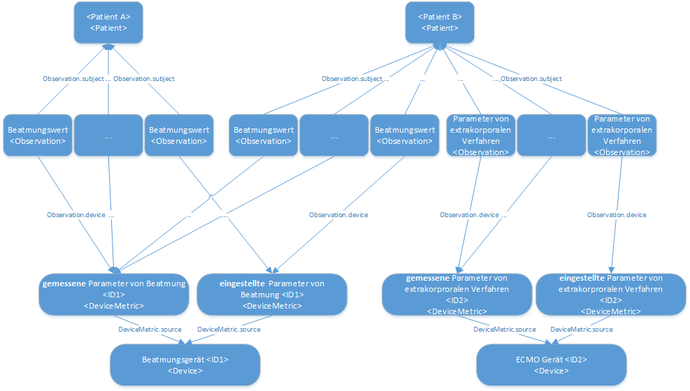

# Profiles - MII IG ICU v2026.0.3

* [**Table of Contents**](toc.md)
* **Profiles**

## Profiles

### Interactive profile map

Module-owned profiles (this package)

##### Extracorporeal procedure parameters

[Extrakorporales Verfahren](StructureDefinition-mii-pr-icu-extrakorporales-verfahren.md)
[Eingestellte Gemessene Parameter Extrakorporale Verfahren](StructureDefinition-mii-pr-icu-dm-eingest-gem-parameter-extrakorporale-verfahren.md)
[Parameter von Extrakorporalen Verfahren](StructureDefinition-mii-pr-icu-parameter-von-extrakorporalen-verfahren.md)
[Arterieller Druck](StructureDefinition-mii-pr-icu-ect-arterieller-druck.md)
[Blutfluss Cardiovasculaeres Geraet](StructureDefinition-mii-pr-icu-ect-blutfluss-cardiovasculaeres-geraet.md)
[Blutfluss Extrakorporaler Gasaustausch](StructureDefinition-mii-pr-icu-ect-blutfluss-extrakorporaler-gasaustausch.md)
[Blutflussindex Extrakorporaler Gasaustausch](StructureDefinition-mii-pr-icu-ect-blutflussindex-extrakorporaler-gasaustausch.md)
[Dauer Extrakorporaler Gasaustausch](StructureDefinition-mii-pr-icu-ect-dauer-extrakorporaler-gasaustausch.md)
[Dauer Haemodialysesitzung](StructureDefinition-mii-pr-icu-ect-dauer-haemodialysesitzung.md)
[Gasfluss](StructureDefinition-mii-pr-icu-ect-gasfluss.md)
[Haemodialyse Blutfluss](StructureDefinition-mii-pr-icu-ect-haemodialyse-blutfluss.md)
[Ionisiertes Kalzium Nierenersatzverfahren](StructureDefinition-mii-pr-icu-ect-ionisiertes-kalzium-nierenersatzverfahren.md)
[Substituatfluss](StructureDefinition-mii-pr-icu-ect-substituatfluss.md)
[Substituatvolumen](StructureDefinition-mii-pr-icu-ect-substituatvolumen.md)
[Venoeser Druck](StructureDefinition-mii-pr-icu-ect-venoeser-druck.md)

##### Ventilation values

[Beatmung](StructureDefinition-mii-pr-icu-beatmung.md)
[Eingestellte Gemessene Parameter Beatmung](StructureDefinition-mii-pr-icu-dm-eingestellte-gemessene-parameter-beatmung.md)
[Parameter von Beatmung](StructureDefinition-mii-pr-icu-parameter-von-beatmung.md)
[Atemwegsdruck Bei Null Expiratorischem Gasfluss](StructureDefinition-mii-pr-icu-vent-atemwegsdruck-bei-null-expiratorischem-gasfluss.md)
[Atemwegsdruck Bei Mittlerem Expiratorischem Gasfluss](StructureDefinition-mii-pr-icu-vent-atemwegsdruck-mittlerem-expiratorischem-gasfluss.md)
[Atemzugvolumen Einstellung](StructureDefinition-mii-pr-icu-vent-atemzugvolumen-einstellung.md)
[Atemzugvolumen Waehrend Beatmung](StructureDefinition-mii-pr-icu-vent-atemzugvolumen-waehrend-beatmung.md)
[Beatmungsvolumen Pro Minute Maschineller Beatmung](StructureDefinition-mii-pr-icu-vent-beatmungsvolumen-min-maschineller-beatmung.md)
[Beatmungszeit Hohem Druck](StructureDefinition-mii-pr-icu-vent-beatmungszeit-hohem-druck.md)
[Beatmungszeit Niedrigem Druck](StructureDefinition-mii-pr-icu-vent-beatmungszeit-niedrigem-druck.md)
[Druckdifferenz Beatmung](StructureDefinition-mii-pr-icu-vent-druckdifferenz-beatmung.md)
[Dynamische Kompliance](StructureDefinition-mii-pr-icu-vent-dynamische-kompliance.md)
[Eingestellter Inspiratorischer Gasfluss](StructureDefinition-mii-pr-icu-vent-eingestellter-inspiratorischer-gasfluss.md)
[Einstellung Ausatmungszeit Beatmung](StructureDefinition-mii-pr-icu-vent-einstellung-ausatmungszeit-beatmung.md)
[Einstellung Einatmungszeit Beatmung](StructureDefinition-mii-pr-icu-vent-einstellung-einatmungszeit-beatmung.md)
[Endexpiratorischer Kohlendioxidpartialdruck](StructureDefinition-mii-pr-icu-vent-endexpiratorischer-kohlendioxidpartialdruck.md)
[Exspiratorischer Gasfluss](StructureDefinition-mii-pr-icu-vent-exspiratorischer-gasfluss.md)
[Exspiratorischer Sauerstoffpartialdruck](StructureDefinition-mii-pr-icu-vent-exspiratorischer-sauerstoffpartialdruck.md)
[Horowitz In Arteriellem Blut](StructureDefinition-mii-pr-icu-vent-horowitz-in-arteriellem-blut.md)
[Inspiratorische Sauerstofffraktion](StructureDefinition-mii-pr-icu-vent-inspiratorische-sauerstofffraktion.md)
[Inspiratorischer Gasfluss](StructureDefinition-mii-pr-icu-vent-inspiratorischer-gasfluss.md)
[Maximaler Beatmungsdruck](StructureDefinition-mii-pr-icu-vent-maximaler-beatmungsdruck.md)
[Maximaler Inspiratorischer Beatmungsdruck](StructureDefinition-mii-pr-icu-vent-maximaler-inspiratorischer-beatmungsdruck.md)
[Mechanische Atemfrequenz Beatmet](StructureDefinition-mii-pr-icu-vent-mechanische-atemfrequenz-beatmet.md)
[Mittlerer Beatmungsdruck](StructureDefinition-mii-pr-icu-vent-mittlerer-beatmungsdruck.md)
[Mittlerer Inspiratorischer Beatmungsdruck](StructureDefinition-mii-pr-icu-vent-mittlerer-inspiratorischer-beatmungsdruck.md)
[Plateau Beatmungsdruck](StructureDefinition-mii-pr-icu-vent-plateau-beatmungsdruck.md)
[Positiv Endexpiratorischer Druck](StructureDefinition-mii-pr-icu-vent-positiv-endexpiratorischer-druck.md)
[Spontane Atemfrequenz Beatmet](StructureDefinition-mii-pr-icu-vent-spontane-atemfrequenz-beatmet.md)
[Spontane Mechanische Atemfrequenz Beatmet](StructureDefinition-mii-pr-icu-vent-spontane-mechanische-atemfrequenz-beatmet.md)
[Spontanes Atemzugvolumen](StructureDefinition-mii-pr-icu-vent-spontanes-atemzugvolumen.md)
[Spontanes Plus Mechanisches Atemzugvolumen](StructureDefinition-mii-pr-icu-vent-spontanes-plus-mechanisches-atemzugvolumen.md)
[Unterstuetzungsdruck Beatmung](StructureDefinition-mii-pr-icu-vent-unterstuetzungsdruck-beatmung.md)
[Zeitverhaeltnis Ein Ausatmung](StructureDefinition-mii-pr-icu-vent-zeitverhaeltnis-ein-ausatmung.md)

##### Balances

[Bilanz](StructureDefinition-mii-pr-icu-bilanz.md)
[Bilanz Ausfuhr Blutverlust](StructureDefinition-mii-pr-icu-bilanz-ausfuhr-blutverlust.md)
[Bilanz Ausfuhr Drainage Generisch](StructureDefinition-mii-pr-icu-bilanz-ausfuhr-drainage-generisch.md)
[Bilanz Ausfuhr Fluessigkeit Gesamt](StructureDefinition-mii-pr-icu-bilanz-ausfuhr-fluessigkeit-gesamt.md)
[Bilanz Ausfuhr Gallenfluessigkeit](StructureDefinition-mii-pr-icu-bilanz-ausfuhr-gallenfluessigkeit.md)
[Bilanz Ausfuhr Haemofiltration Einzelmesswerte](StructureDefinition-mii-pr-icu-bilanz-ausfuhr-haemofiltration-einzelmesswerte.md)
[Bilanz Ausfuhr Magensonde](StructureDefinition-mii-pr-icu-bilanz-ausfuhr-magensonde.md)
[Bilanz Ausfuhr OP Drainage](StructureDefinition-mii-pr-icu-bilanz-ausfuhr-op-drainage.md)
[Bilanz Ausfuhr Pankreasdrainage](StructureDefinition-mii-pr-icu-bilanz-ausfuhr-pankreasdrainage.md)
[Bilanz Ausfuhr Stuhlgang](StructureDefinition-mii-pr-icu-bilanz-ausfuhr-stuhlgang.md)
[Bilanz Ausfuhr Urin](StructureDefinition-mii-pr-icu-bilanz-ausfuhr-urin.md)
[Bilanz Ausfuhr Wunddrainage](StructureDefinition-mii-pr-icu-bilanz-ausfuhr-wunddrainage.md)
[Bilanz Einfuhr Abgepumpte Muttermilch](StructureDefinition-mii-pr-icu-bilanz-einfuhr-abgepumpte-muttermilch.md)
[Bilanz Einfuhr Enterale Fluessigkeit](StructureDefinition-mii-pr-icu-bilanz-einfuhr-enterale-fluessigkeit.md)
[Bilanz Einfuhr Fluessigkeit Gesamt](StructureDefinition-mii-pr-icu-bilanz-einfuhr-fluessigkeit-gesamt.md)
[Bilanz Einfuhr Muttermilch](StructureDefinition-mii-pr-icu-bilanz-einfuhr-muttermilch.md)
[Bilanz Einfuhr Orale Fluessigkeit](StructureDefinition-mii-pr-icu-bilanz-einfuhr-orale-fluessigkeit.md)
[Bilanz Einfuhr Saeuglingsnahrung](StructureDefinition-mii-pr-icu-bilanz-einfuhr-saeuglingsnahrung.md)
[Bilanz Einfuhr Spendermilch](StructureDefinition-mii-pr-icu-bilanz-einfuhr-spendermilch.md)
[Bilanz Tagesbilanz Fluessigkeit](StructureDefinition-mii-pr-icu-bilanz-tagesbilanz-fluessigkeit.md)

##### Monitoring and vital signs (module-owned)

[MUV Arterieller Blutdruck](StructureDefinition-mii-pr-icu-muv-arterieller-blutdruck.md)
[MUV Atemfrequenz](StructureDefinition-mii-pr-icu-muv-atemfrequenz.md)
[MUV Herzfrequenz](StructureDefinition-mii-pr-icu-muv-herzfrequenz.md)
[MUV Koerpergewicht](StructureDefinition-mii-pr-icu-muv-koerpergewicht.md)
[MUV Koerpergroesse](StructureDefinition-mii-pr-icu-muv-koerpergroesse.md)
[MUV Koerperlaenge](StructureDefinition-mii-pr-icu-muv-koerperlaenge.md)
[MUV Kopfumfang](StructureDefinition-mii-pr-icu-muv-kopfumfang.md)
[MUV zerebraler Perfusionsdruck](StructureDefinition-mii-pr-icu-muv-zerebraler-perfusionsdruck.md)

##### Examinations

[Untersuchung Pupillenbefund](StructureDefinition-mii-pr-icu-untersuchung-pupillenbefund.md)
[Untersuchung Pupillenform](StructureDefinition-mii-pr-icu-untersuchung-pupillenform.md)
[Untersuchung Pupillengroesse](StructureDefinition-mii-pr-icu-untersuchung-pupillengroesse.md)
[Untersuchung Pupillenlichtreaktion Direkt](StructureDefinition-mii-pr-icu-untersuchung-pupillenlichtreaktion-direkt.md)
[Untersuchung Pupillenlichtreaktion Indirekt](StructureDefinition-mii-pr-icu-untersuchung-pupillenlichtreaktion-indirekt.md)
[Untersuchung Pupillensymmetrie](StructureDefinition-mii-pr-icu-untersuchung-pupillensymmetrie.md)

##### Scores

[Score](StructureDefinition-mii-pr-icu-score.md)
[Score CAM-ICU](StructureDefinition-mii-pr-icu-score-cam-icu.md)
[Score Faces Pain Scale Revised](StructureDefinition-mii-pr-icu-score-faces-pain-scale-revised.md)
[Score GCS](StructureDefinition-mii-pr-icu-score-gcs.md)
[Score ICDSC](StructureDefinition-mii-pr-icu-score-icdsc.md)
[Score Numerische Ratingskala](StructureDefinition-mii-pr-icu-score-numerische-ratingskala.md)
[Score RASS](StructureDefinition-mii-pr-icu-score-rass.md)
[Score SOFA](StructureDefinition-mii-pr-icu-score-sofa.md)
[Score Visuelle Analogskala](StructureDefinition-mii-pr-icu-score-visuelle-analogskala.md)
[Score Wong-Baker-FACES-Schmerzskala](StructureDefinition-mii-pr-icu-score-wong-baker-faces-schmerzskala.md)
[Score ZOPA](StructureDefinition-mii-pr-icu-score-zopa.md)

##### Device information

[Device](StructureDefinition-mii-pr-icu-device.md)

ISiK-hosted profiles (de.gematik.isik 6.0.0)

These profiles are hosted and versioned by gematik in the de.gematik.isik package; this guide lists them as clinical content of the ICU core data set. The list is generated from the pinned package version and only changes with a deliberate pin bump.

##### Generic profiles (3)

[Koerpertemperatur Generisch](https://simplifier.net/resolve?canonical=https://gematik.de/fhir/isik/StructureDefinition/sd-mii-icu-koerpertemperatur-generisch)
[Monitoring und Vitaldaten](https://simplifier.net/resolve?canonical=https://gematik.de/fhir/isik/StructureDefinition/sd-mii-icu-monitoring-und-vitaldaten)
[Sonstige pulsatile Druecke Generisch](https://simplifier.net/resolve?canonical=https://gematik.de/fhir/isik/StructureDefinition/sd-mii-icu-sonstige-pulsatile-druecke-generisch)

##### Monitoring specialisations (25)

[Herzzeitvolumen](https://simplifier.net/resolve?canonical=https://gematik.de/fhir/isik/StructureDefinition/sd-mii-icu-herzzeitvolumen)
[Ideales Koerpergewicht](https://simplifier.net/resolve?canonical=https://gematik.de/fhir/isik/StructureDefinition/sd-mii-icu-ideales-koerpergewicht)
[Intrakranieller Druck ICP](https://simplifier.net/resolve?canonical=https://gematik.de/fhir/isik/StructureDefinition/sd-mii-icu-intrakranieller-druck-icp)
[Koerpergewicht Percentil Altersabhaengig](https://simplifier.net/resolve?canonical=https://gematik.de/fhir/isik/StructureDefinition/sd-mii-icu-koerpergewicht-percentil-altersabhaengig)
[Koerpergroesse Percentil](https://simplifier.net/resolve?canonical=https://gematik.de/fhir/isik/StructureDefinition/sd-mii-icu-koerpergroesse-percentil-altersabhaengig)
[Linksatrialer Druck](https://simplifier.net/resolve?canonical=https://gematik.de/fhir/isik/StructureDefinition/sd-mii-icu-linksatrialer-druck)
[Linksventrikulaerer Herzindex durch Indikatorverduennung](https://simplifier.net/resolve?canonical=https://gematik.de/fhir/isik/StructureDefinition/sd-mii-icu-linksventri-herzindex-durch-indikatorverduennung)
[Linksventrikulaeres Schlagvolumen Durch Indikatorverduennung](https://simplifier.net/resolve?canonical=https://gematik.de/fhir/isik/StructureDefinition/sd-mii-icu-linksventri-schlagvolumen-durch-indikatorverduennung)
[Linksventrikulaerer Schlagvolumenindex Durch Indikatorverduennung](https://simplifier.net/resolve?canonical=https://gematik.de/fhir/isik/StructureDefinition/sd-mii-icu-linksventri-schlagvolumenindex-durch-indikatorverd)
[Linksventrikulaerer Druck](https://simplifier.net/resolve?canonical=https://gematik.de/fhir/isik/StructureDefinition/sd-mii-icu-linksventrikulaerer-druck)
[Linksventrikulaerer Herzindex](https://simplifier.net/resolve?canonical=https://gematik.de/fhir/isik/StructureDefinition/sd-mii-icu-linksventrikulaerer-herzindex)
[Linksventrikulaeres Schlagvolumen](https://simplifier.net/resolve?canonical=https://gematik.de/fhir/isik/StructureDefinition/sd-mii-icu-linksventrikulaeres-schlagvolumen)
[Linksventrikulaeres Schlagvolumenindex](https://simplifier.net/resolve?canonical=https://gematik.de/fhir/isik/StructureDefinition/sd-mii-icu-linksventrikulaeres-schlagvolumenindex)
[Linksventrikulaeres Herzzeitvolumen Durch Indikatorverduennung](https://simplifier.net/resolve?canonical=https://gematik.de/fhir/isik/StructureDefinition/sd-mii-icu-linksventri-herzzeitvolumen-durch-indikatorverd)
[Sauerstoffsaettigung Im Arteriellen Blut Durch Pulsoxymetrie](https://simplifier.net/resolve?canonical=https://gematik.de/fhir/isik/StructureDefinition/sd-mii-icu-o2saettigung-im-arteriellen-blut-durch-pulsoxymetrie)
[Sauerstoffsaettigung Im Blut Postduktal Durch Pulsoxymetrie](https://simplifier.net/resolve?canonical=https://gematik.de/fhir/isik/StructureDefinition/sd-mii-icu-o2saettigung-im-blut-postduktal-durch-pulsoxymetrie)
[Sauerstoffsaettigung Im Blut Preduktal Durch Pulsoxymetrie](https://simplifier.net/resolve?canonical=https://gematik.de/fhir/isik/StructureDefinition/sd-mii-icu-o2saettigung-im-blut-preduktal-durch-pulsoxymetrie)
[Pulmonalarterieller Blutdruck](https://simplifier.net/resolve?canonical=https://gematik.de/fhir/isik/StructureDefinition/sd-mii-icu-pulmonalarterieller-blutdruck)
[Pulmonalarterieller Wedge Druck](https://simplifier.net/resolve?canonical=https://gematik.de/fhir/isik/StructureDefinition/sd-mii-icu-pulmonalarterieller-wedge-druck)
[Pulmonalvaskulaerer Widerstandsindex](https://simplifier.net/resolve?canonical=https://gematik.de/fhir/isik/StructureDefinition/sd-mii-icu-pulmonalvaskulaerer-widerstandsindex)
[Puls](https://simplifier.net/resolve?canonical=https://gematik.de/fhir/isik/StructureDefinition/sd-mii-icu-puls)
[Rechtsatrialer Druck](https://simplifier.net/resolve?canonical=https://gematik.de/fhir/isik/StructureDefinition/sd-mii-icu-rechtsatrialer-druck)
[Rechtsventrikulaerer Druck](https://simplifier.net/resolve?canonical=https://gematik.de/fhir/isik/StructureDefinition/sd-mii-icu-rechtsventrikulaerer-druck)
[Systemischer Vaskulaerer Widerstandsindex](https://simplifier.net/resolve?canonical=https://gematik.de/fhir/isik/StructureDefinition/sd-mii-icu-systemischer-vaskulaerer-widerstandsindex)
[Zentralvenoeser Blutdruck](https://simplifier.net/resolve?canonical=https://gematik.de/fhir/isik/StructureDefinition/sd-mii-icu-zentralvenoeser-blutdruck)

##### Body temperature (21)

[Koerperkerntemperatur Stirn](https://simplifier.net/resolve?canonical=https://gematik.de/fhir/isik/StructureDefinition/sd-mii-icu-koerperkerntemperatur-stirn)
[Koerpertemperatur Achsel](https://simplifier.net/resolve?canonical=https://gematik.de/fhir/isik/StructureDefinition/sd-mii-icu-koerpertemperatur-achsel)
[Koerpertemperatur Atemwege](https://simplifier.net/resolve?canonical=https://gematik.de/fhir/isik/StructureDefinition/sd-mii-icu-koerpertemperatur-atemwege)
[Koerpertemperatur Blut](https://simplifier.net/resolve?canonical=https://gematik.de/fhir/isik/StructureDefinition/sd-mii-icu-koerpertemperatur-blut)
[Koerpertemperatur Brust](https://simplifier.net/resolve?canonical=https://gematik.de/fhir/isik/StructureDefinition/sd-mii-icu-koerpertemperatur-brust)
[Koerpertemperatur Brustwirbelsaeule](https://simplifier.net/resolve?canonical=https://gematik.de/fhir/isik/StructureDefinition/sd-mii-icu-koerpertemperatur-brustwirbelsaeule)
[Koerpertemperatur Gelenk](https://simplifier.net/resolve?canonical=https://gematik.de/fhir/isik/StructureDefinition/sd-mii-icu-koerpertemperatur-gelenk)
[Koerpertemperatur Halswirbelsaeule](https://simplifier.net/resolve?canonical=https://gematik.de/fhir/isik/StructureDefinition/sd-mii-icu-koerpertemperatur-halswirbelsaeule)
[Koerpertemperatur Harnblase](https://simplifier.net/resolve?canonical=https://gematik.de/fhir/isik/StructureDefinition/sd-mii-icu-koerpertemperatur-harnblase)
[Koerpertemperatur Kern](https://simplifier.net/resolve?canonical=https://gematik.de/fhir/isik/StructureDefinition/sd-mii-icu-koerpertemperatur-kern)
[Koerpertemperatur Leiste](https://simplifier.net/resolve?canonical=https://gematik.de/fhir/isik/StructureDefinition/sd-mii-icu-koerpertemperatur-leiste)
[Koerpertemperatur Lendenwirbelsaeule](https://simplifier.net/resolve?canonical=https://gematik.de/fhir/isik/StructureDefinition/sd-mii-icu-koerpertemperatur-lendenwirbelsaeule)
[Koerpertemperatur Myokard](https://simplifier.net/resolve?canonical=https://gematik.de/fhir/isik/StructureDefinition/sd-mii-icu-koerpertemperatur-myokard)
[Koerpertemperatur nasal](https://simplifier.net/resolve?canonical=https://gematik.de/fhir/isik/StructureDefinition/sd-mii-icu-koerpertemperatur-nasal)
[Koerpertemperatur Nasen-Rachen-Raum](https://simplifier.net/resolve?canonical=https://gematik.de/fhir/isik/StructureDefinition/sd-mii-icu-koerpertemperatur-nasen-rachen-raum)
[Koerpertemperatur rektal](https://simplifier.net/resolve?canonical=https://gematik.de/fhir/isik/StructureDefinition/sd-mii-icu-koerpertemperatur-rektal)
[Koerpertemperatur Speiseroehre](https://simplifier.net/resolve?canonical=https://gematik.de/fhir/isik/StructureDefinition/sd-mii-icu-koerpertemperatur-speiseroehre)
[Koerpertemperatur Stirn](https://simplifier.net/resolve?canonical=https://gematik.de/fhir/isik/StructureDefinition/sd-mii-icu-koerpertemperatur-stirn)
[Koerpertemperatur Trommelfell](https://simplifier.net/resolve?canonical=https://gematik.de/fhir/isik/StructureDefinition/sd-mii-icu-koerpertemperatur-trommelfell)
[Koerpertemperatur unter der Zunge](https://simplifier.net/resolve?canonical=https://gematik.de/fhir/isik/StructureDefinition/sd-mii-icu-koerpertemperatur-unter-der-zunge)
[Koerpertemperatur vaginal](https://simplifier.net/resolve?canonical=https://gematik.de/fhir/isik/StructureDefinition/sd-mii-icu-koerpertemperatur-vaginal)

Observation
Procedure
DeviceMetric
Device  amber = externally hosted (links open Simplifier)

The FHIR profiles in this project follow the following approach:

There is at least one **generic profile** for each of the "structure elements" of the KDS module defined in the data model. These profiles contain ValueSets and describe the predefined **structure for groups of items in a specific intensive care category**. The generic profiles are the first in each group of the tree structure of this guide, i.e:

* Parameters of extracorporeal procedures: - [Extracorporeal procedures (Procedure)](StructureDefinition-mii-pr-icu-extrakorporales-verfahren.md) - [Set and measured parameters (DeviceMetric)](StructureDefinition-mii-pr-icu-dm-eingest-gem-parameter-extrakorporale-verfahren.md) - [Parameters of extracorporeal procedures (Observation)](StructureDefinition-mii-pr-icu-parameter-von-extrakorporalen-verfahren.md)
* Ventilation values: - [Ventilation (Procedure)](StructureDefinition-mii-pr-icu-beatmung.md) - [Set and measured parameters (DeviceMetric)](StructureDefinition-mii-pr-icu-dm-eingest-gem-parameter-extrakorporale-verfahren.md) - [Ventilation parameters (Observation)](StructureDefinition-mii-pr-icu-parameter-von-beatmung.md)
* Monitoring and vital data - [Monitoring and vital data (Observation)](profiles.md) - [Other pulsatile pressures generic (Observation)](profiles.md)

There are also **specific profiles**, which **fix** the code and unit affiliations. These specific resources are intended, among other things, as a **handout for the implementer** and should help to reduce the hurdle of correct semantic annotation and improve interoperability. The specific profiles are all those that are connected to the above-mentioned generic profiles within a group.

### Device information

We consider **measuring and pre-set devices** (see [module description](index.md)). This is the minimum level of differentiation we need to map the data modelled in this module. The DeviceMetric carries the information whether the value is measured or set. A device resource describes which device is set or measures a value. The device is referenced from the DeviceMetric. Depending on the amount of information, available, different modelling levels are available here:

## 1. No device information

 For a group of values that share a common measurement method and a common measurement device, a common pair of DeviceMetric and Device can be created and referenced from Observation.device. This is particularly necessary if no device information is available.

If there is no device information available, you can limit yourself to two DeviceMetrics per category (vital data, extracorporeal procedures …), each of which states whether an observation (more precisely Observation.value) is a set or measured value.

In summary, we need one resource for each combination of Observation.type and Observation.category.

| Field | Meaning | | — | — | | Observation.type | Corresponds to the Observation.category of the referencing observation. Note the corresponding ValueSets

* [extrakorporal procedures](StructureDefinition-mii-pr-icu-parameter-von-extrakorporalen-verfahren.md) (Snomed- [Code 182744004](https://browser.ihtsdotools.org/?perspective=full&conceptId1=182744004&edition=MAIN/2022-05-31&release=&languages=en) )
*  

| |
| :--- |
| [ventilation](StructureDefinition-mii-pr-icu-dm-eingest-gem-parameter-extrakorporale-verfahren.md)(siehe[MII_Category_Procedure_Beatmung_SNOMED](https://simplifier.net/medizininformatikinitiative-modul-intensivmedizin/mii-vs-icu-category-procedure-beatmung-snomed)) |

 

| | |
| :--- | :--- |
| Observation.category | measured/set/… |

## 2. Type of device

You can also create device resources according to the two fields marked "optional*" under 1. This is particularly useful if you can specify additional information for device classes, such as the same manufacturer for all ventilators.

## 3. Device properties

 If further information is known about the measuring and set devices, or even device IDs are communicated, a separate resource can be created for each device that can be identified in this way via a device ID. The diagram above attempts to illustrate the possible relationships. On the one hand, a device (DeviceMetric and Device) can generate values for different patients over time; on the other hand, several devices can provide values for a single patient at the same time.

**Note:** As a device can only ever be referenced by a higher-level DeviceMetric in the selected modelling, the reverse conclusion is that with this detailed implementation, an associated DeviceMetric (or a pair for measured and set parameters) must be created for each device resource.

### Monitoring and vital signs (ISiK-hosted)

> **Written during migration - review before release.** The Monitoring and Vital Signs profiles of this module are published inside the ISiK package `de.gematik.isik` (6.0.0) as `sd-mii-icu-*` and are therefore rendered by that package, not by this guide. The source guide carried one page per profile; those pages contained only the generic-profile reference sentence, which is preserved below once, followed by the complete profile list.

> Original wording of the source pages (per profile): ""Body weight (Observation)" is a characteristic of the generic profile for monitoring and vital data (Observation). See there for more detailed information regarding explanations of the items or reference of the entries in the FHIR resource to the Logical Model."For the pulsatile pressures additionally: "This is a pulsatile pressure. In addition to the properties of the generic profile for Monitoring and vital data, the special features described on the page of the profile for other pulsatile pressures generic (Observation) also apply to this. See there for more detailed information regarding explanations of the items or reference of the entries in the FHIR resource to the Logical Model."

The individual profiles are characteristics of the generic profile [Monitoring and vital data (Observation)](https://simplifier.net/resolve?canonical=https://gematik.de/fhir/isik/StructureDefinition/sd-mii-icu-monitoring-und-vitaldaten). See there for details on the items and their relation to the Logical Model.

